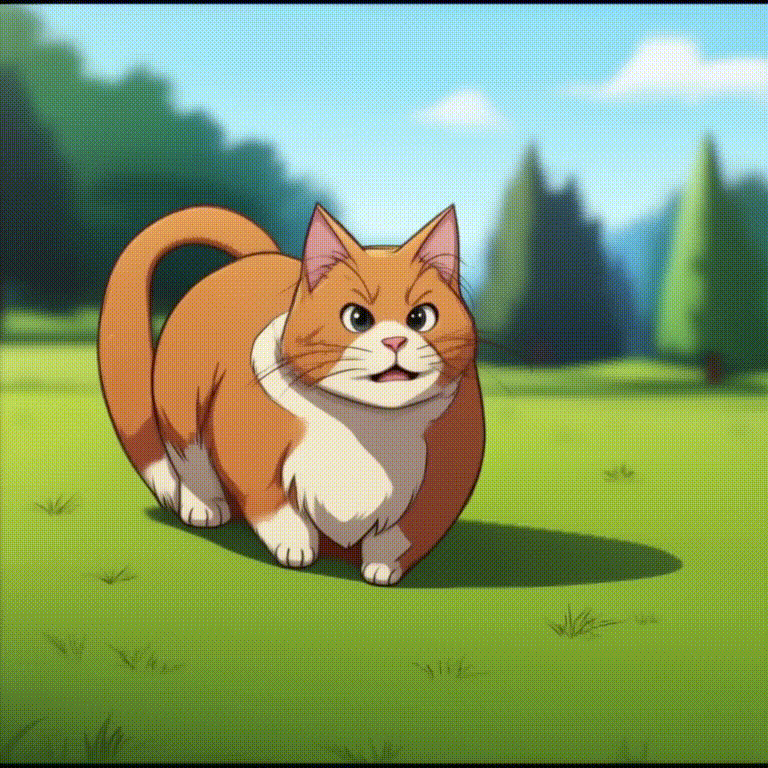

# hunyuanvideo-community/HunyuanVideo LoRA Cog Model

This is an implementation of [hunyuanvideo-community/HunyuanVideo](https://huggingface.co/hunyuanvideo-community/HunyuanVideo) as a [Cog](https://github.com/replicate/cog) model to explore LoRAs.

## Development

Follow the [model pushing guide](https://replicate.com/docs/guides/push-a-model) to push your own model to [Replicate](https://replicate.com).

## How to use

Make sure you have [cog](https://github.com/replicate/cog) installed.

To run a prediction:

    cog predict -i prompt="Style of snomexut, A vibrant yellow Tuxemon, wielding a fiery blue staff, joyfully manipulates swirling flames around its cheerful form." -i extra_lora="a-r-r-o-w/HunyuanVideo-tuxemons"

